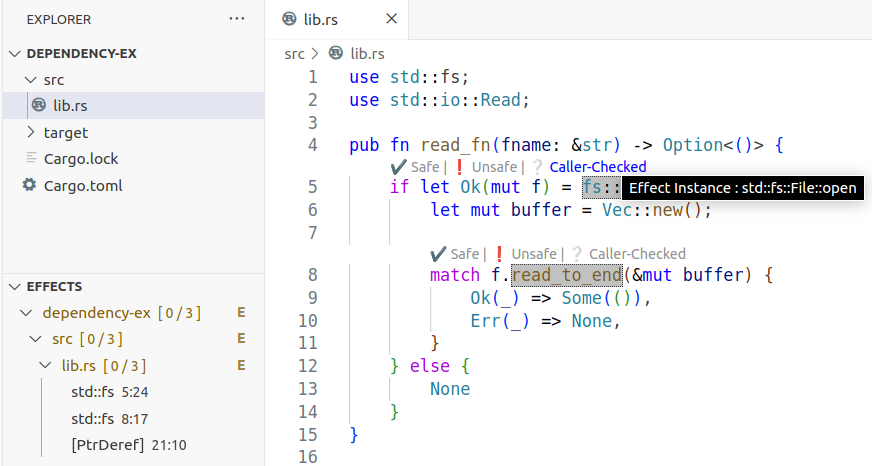

# Cargo Scan

Cargo Scan is a tool for auditing Rust crates.




**⚠️ Please note that Cargo Scan is under active development. Some interfaces may be subject to change.**

## Quick-start

1. Clone this repository.
2. Run `rustup update` to ensure you have the latest version of Rust (or install it via the [official website]((https://www.rust-lang.org/tools/install))).
3. Run `cargo build`.

Once built, either:

4. Follow the instructions to install the VSCode extension below; or
5. If you prefer to use Cargo Scan as a basic CLI tool or want to incorporate it in other projects, see "using the CLI tool" below.

## Using the VSCode Extension

For the most intuitive and interactive experience, we recommend using Cargo Scan through the VSCode extension.

### Installing the extension in VSCode

1. Build the extension by running `make` in the `editor-plugin` directory. This will produce a `.vsix` file in that location.
2. Launch VSCode and install the extension from the `.vsix` file:
    - Press `Ctrl + Shift + P` (Windows/Linux) or `Cmd + Shift + P` (macOS) to open the Command Palette.
    - Type "Extensions: Install from VSIX..." and select it.
    - Navigate to the folder where the .vsix file is located and open it.

The extension is automatically activated when a Rust package is detected in the workspace.

### Performing an audit in VSCode

Ensure that you have opened a directory containing a Rust crate in VSCode.
Theen, there are two types of audits you can perform with Cargo Scan in VSCode:
1. **Single Crate Audit:** This scans the currently open package for side effects (see below).
- To run a single crate audit type `cargo-scan: Audit Crate` in the Command Palette.
2. **Chain Audit:** This performs a full audit and also scans the transitive dependencies of the open package.
- To run a chain audit, create the chain by typing `cargo-scan: Create Chain` in the Command Palette and then perform the actual audit by running the command `cargo-scan: Audit Chain`.

The set of side effects that Cargo Scan identifies are shown in the Effects view of the Explorer side bar.

### I'm seeing something about "effects" - what's a side effect?

Basically, it represents some behavior of a function that is not visible in its function signature - and that might or might not be dangerous (e.g., operating system calls, memory unsafety, or filesystem/network access). See [Wikipedia](https://en.wikipedia.org/wiki/Side_effect_(computer_science)) for a more general discussion. These are behaviors that you may want to look into further when auditing a crate.

## Using the CLI tool

You can also use Cargo Scan as a CLI tool, which can be useful for accessing the raw data for incorporating in other projects. To scan a crate, simply run the binary (from this repository), providing it with a path to the crate:
```
cargo run --bin scan <path to crate>
```

This provides the simplest available output, which is returned in CSV format as a list of side effects, one per line.
The beginning of the line gives the crate name, the function body and callee that contains the effect, and the effect type or pattern that it matches.
The last four items on each line give the directory, file, line, and column where the effect occurs.
Example output is as follows:
```
$ cargo run --bin scan data/packages/rand
    Finished `dev` profile [unoptimized + debuginfo] target(s) in 0.14s
     Running `target/debug/scan data/packages/rand`
crate, fn_decl, callee, effect, dir, file, line, col
rand, rand::distributions::other::<Standard as Distribution<char>>::sample, core::char::from_u32_unchecked, [UnsafeCall], data/packages/rand/src/distributions, other.rs, 94, 17
rand, rand::distributions::other::<Alphanumeric as DistString>::append_string, alloc::string::String::as_mut_vec, [UnsafeCall], data/packages/rand/src/distributions, other.rs, 136, 27
...
rand, rand::distributions::uniform::<Uniform<char> as super::DistString>::append_string, core::char::methods::len_utf8, [FnPtrCreation], data/packages/rand/src/distributions, uniform.rs, 860, 50

num_effects, total, loc_lb, loc_ub, macros, loc_lb, loc_ub, conditional_code, loc_lb, loc_ub, skipped_calls, loc_lb, loc_ub, skipped_fn_ptrs, loc_lb, loc_ub, skipped_other, loc_lb, loc_ub, unsafe_trait, loc_lb, loc_ub, unsafe_impl, loc_lb, loc_ub, pub_fns, pub_fns_with_effects, pub_total_effects, audited_fns, audited_loc
12, 25, 8708, 8708, 127, 1117, 1185, 21, 2410, 2410, 0, 0, 0, 0, 0, 0, 25, 3, 25, 0, 0, 0, 0, 0, 0, 53, 23, 52, 58, 540
```

If you don't want the last two lines (totals at the bottom), suppress them with the `-s` option.

For additional usage options, run `help`:
```
cargo run --bin scan -- --help
```

### If you don't have a crate on your system

You can run one of our provided example crates in `data/test-packages`:
```
cargo run --bin scan data/test-packages/permissions-ex
```

## Additional usage options

### Running the unit tests

- Run `cargo test` to run Rust unit tests.

- Run `make test` to re-run the tool on all our test packages, whose results are in `data/results` and placed under version control to check for any regressions.

- See the `Makefile` for other targets and options!

### Running in tandem with other tools

Cargo Scan can also be used in tandem with other Rust supply chain auditing tools, such as [cargo vet](https://mozilla.github.io/cargo-vet/).

### Your use case here!

We are interested in exploring other use cases for integration; if you think Cargo Scan would be useful for your project, let us know!

## Additional information

### Repository structure

Most of the source code of Cargo Scan can be found in `src/`, with miscellaneous data and scripts in `data/` and `scripts/`.
The VS Code extension is developed in `lang_server` and `editor-plugin`.

### Current maintainers

Cargo Scan is open source.
It is currently maintained by [Caleb Stanford](https://web.cs.ucdavis.edu/~cdstanford/) and Lydia Zoghbi.
It includes past contributions from other authors at UC Davis PL and UC San Diego PLSysSec.
For copyright information, see the `LICENSE`.

### Issues

We welcome bug reports, suggestions, and pull requests! Please raise an issue or send us an email about your use case.

## Citing this repository

If you want to cite this repository, please consider citing our technical report.
The current draft (in submission) is available below:

- *Auditing Rust Crates Effectively.* Lydia Zoghbi, David Thien, Ranjit Jhala, Deian Stefan, and Caleb Stanford. Preprint (2024). [Draft Link](https://web.cs.ucdavis.edu/~cdstanford/doc/2024/CargoScan-draft.pdf)

You may also cite the repository directly:

- Cargo Scan: a tool for auditing Rust crates. Lydia Zoghbi, David Thien, Ranjit Jhala, Deian Stefan, and Caleb Stanford. GitHub repository (2024). [GitHub Link](https://github.com/PLSysSec/cargo-scan)
